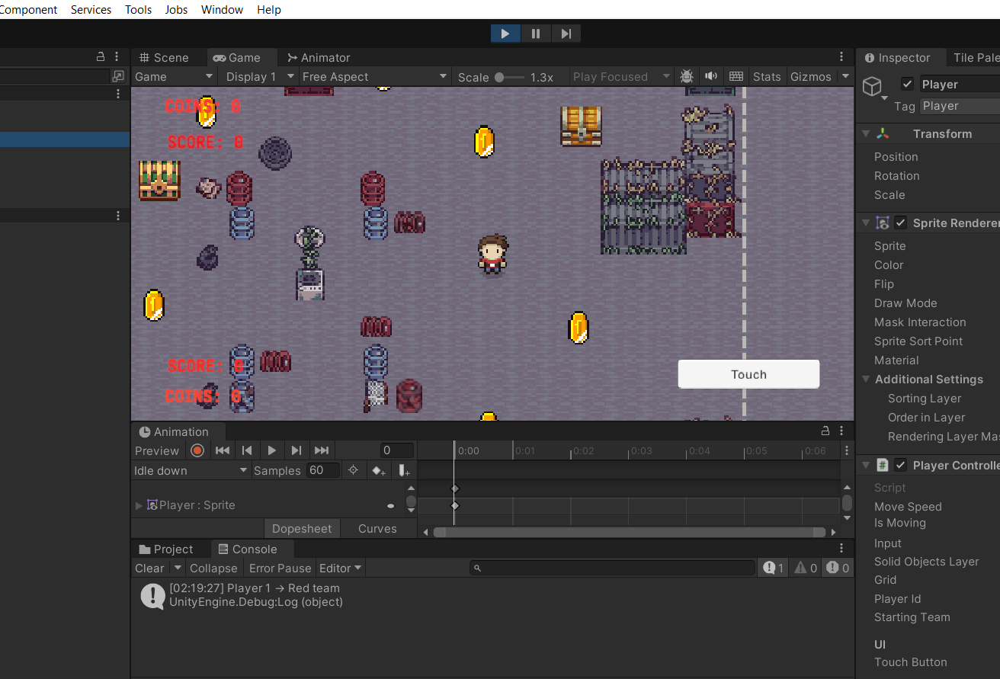
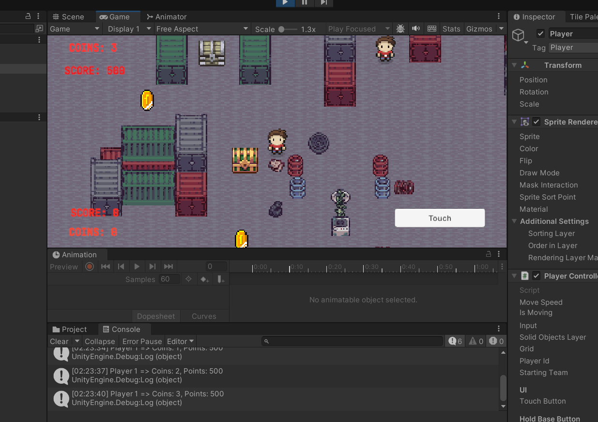

\# Osmosis-Multiplayer-Unity-Game
# Osmosis Multiplayer Unity Game

This is a 2D multiplayer game I built in Unity using Photon Networking.  
It’s inspired by the "King of Clubs" game from *Alice in Borderland*, but I’ve given it my own twist.  

Two teams compete in a maze-like map to collect coins, battle each other, and capture bases for points. The game is fast-paced, strategic, and fun to play with friends.

## What’s in the game
- Real-time multiplayer powered by Photon Fusion
- Two teams of up to five players each
- Coins to collect for boosting your team’s score
- Player vs player battles
- Base capture and defense system
- Maze-style map for strategic gameplay

## Tech I used
- Unity (2D)
- Photon Fusion for networking
- C# scripting
- Free game assets

## How to try it out
1. Clone this repository:
   ```bash
   git clone https://github.com/Akshh-magshh/Osmosis-Multiplayer-Unity-Game.git





